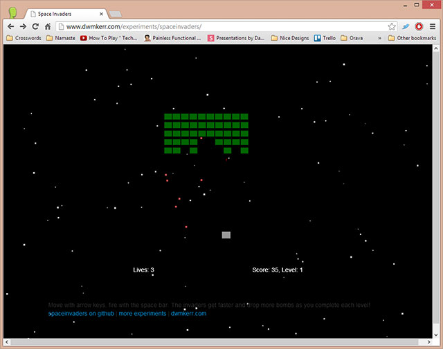

# Space Invaders

The classic Space Invaders game written in JavaScript as a learning exercise.

No jQuery or any other third party libraries, just raw JavaScript, CSS and HTML/html.

See it Live: [www.dwmkerr.com/experiments/spaceinvaders](http://www.dwmkerr.com/experiments/spaceinvaders)

[](http://www.dwmkerr.com/experiments/spaceinvaders)

## Intro

What's there to say? It's Space Invaders in JavaScript!

Create the game, give it a `div` to draw to, tell it when the keyboard is mashed and that's all you need to add Space Invaders to a website.

This is a simple learning exercise, so the JavaScript is deliberate kept all one file. There's no linting, testing, CI, or anything like that. If you want to see such patterns in front-end JavaScript, check out something like [angular-modal-service](https://github.com/dwmkerr/angular-modal-service).

## Adding Space Invaders to a Web Page

First, drop the `spaceinvaders.js` file into the website.

Now add a canvas to the page.

```html
<canvas id="gameCanvas"></canvas>
```

Now add the Space Invaders game code. You create the game, initialise it with the canvas, start it and make sure you tell it when a key is pressed or released. That's it!

```html
<script>
//  Setup the canvas.
var canvas = document.getElementById("gameCanvas");
canvas.width = 800;
canvas.height = 600;

//  Create the game.
var game = new Game();

//  Initialise it with the game canvas.
game.initialise(canvas);

//  Start the game.
game.start();

//  Listen for keyboard events.
var pressedKeys = [];
window.addEventListener("keydown", function keydown(e) {
  var keycode = window.event.keycode || e.which;
    if(!pressedKeys[keycode])
      pressedKeys[keycode] = true;
    //  Supress further processing of left/right/space (37/29/32)
    if(keycode == 37 || keycode == 39 || keycode == 32) {
      e.preventDefault();
    }
    game.keyDown(keycode);
});
window.addEventListener("keyup", function keydown(e) {
  var keycode = window.event.keycode || e.which;
    if(pressedKeys[keycode])
      delete pressedKeys[keycode];
    game.keyUp(keycode);
});
</script>
```

## References

Other bits and pieces that are useful can be dropped here.

- The sounds came from [http://www.classicgaming.cc/classics/spaceinvaders/sounds.php](http://www.classicgaming.cc/classics/spaceinvaders/sounds.php)
